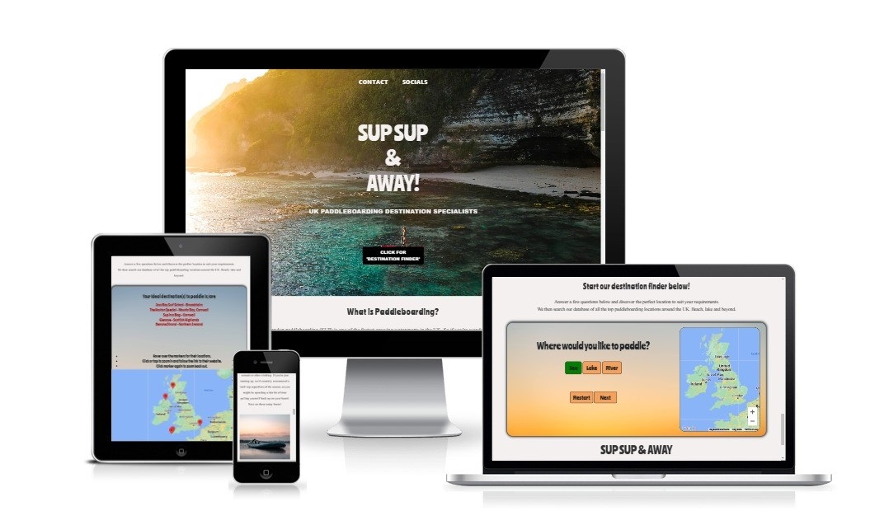

<h1 align = "center">Sup Sup & Away!<h/1>

<h2 align = "center"></h2>

[View the live project here.](https://nddpj00.github.io/sup-sup-away/)
## User Experience (UX)

-   ### User stories

    -   #### First Time Visitor Goals

        1. As a First Time Visitor, I want to easily understand the main purpose of the site.
        2. As a First Time Visitor, I want to be able to easily navigate throughout the site to find content; including links to social media.
        3. As a First Time Visitor, I want to be able to interact with the site. Initiate controls and be given feedback.

     -  #### Returning Visitor Goals

        1. As a Returning Visitor, I want to find information about paddleboarding in the UK.
        2. As a Returning Visitor, I want to find information about where in the UK are good locations to paddleboard.
        3. As a Returning Visitor, I want to know the requirements and equipment needed to paddleboard in the UK.

    -   #### Frequent User Goals
        1. As a Frequent User, I want to find new locations to paddleboard as I become more experienced or how more equipment.
        2. As a Frequent User, I want to use the finder tool to help me plan my paddleboarding breaks.
        3. As a Frequent User, I want to be able to keep up to date with any social media activity relating to Sup Sup & Away!.

-   ### Design
    -   #### Colour Scheme
        -   The main background is off white #f3f0ef. The finder tool includes orange for the buttons and some backgrounds hsl(27, 88%, 66%);. Otherwise the majority of the remainder is made up of photography.
    -   #### Typography
        -   The main headings use a font called 'Ranchers' including the H1 hero and the h2 heading at the beginning of each paragraph. Its typical of the 1950s, used on posters and designed to be big - for maximum effect. I felt it worked well for a surfing feel of the site. The Montserrat font is used for the paragraphs throughout the website with Sans Serif as the fallback font in case for any reason the font isn't being imported into the site correctly.
    -   #### Imagery
        -   I chose photographs that either had a laid back tone or had scenes of attractive landscapes. I feel many people are drawn to Paddleboarding as it gives an opportunity to appreciate your surroundings, practicing a past-time that is slow, relaxed and meditative.

*   ### Wireframes

    -   Large Screen Wireframe - [View](assets/images/images-readme/supsup-wireframe.jpg)

    -   Mobile Screen Wireframe - [View](assets/images/images-readme/supsup-Mobile-wireframe.jpg)

##  Features

-   Responsive on all device sizes

-   Interactive elements including a tool to assist finding locations

## Technologies Used

### Languages Used

-   [HTML5](https://en.wikipedia.org/wiki/HTML5)
-   [CSS3](https://en.wikipedia.org/wiki/Cascading_Style_Sheets)
-   [Javascript](https://en.wikipedia.org/wiki/JavaScript)

### Frameworks, Libraries & Programs Used

1.  [Bootstrap 5.3.0:](https://getbootstrap.com/docs/5.3/getting-started/introduction/)
    - Bootstrap was used to assist with the responsiveness and styling of the website.
1.  [Hover.css:](https://ianlunn.github.io/Hover/)
    - Hover.css was used on the Social Media icons in the footer to add the float transition while being hovered over.
1.  [Google Fonts:](https://fonts.google.com/)
    - Google fonts were used to import the 'Ranchers' and 'Monserrat' fonts into the style.css file.
1.  [GitHub:](https://github.com/)
    - GitHub is used to store the projects code after being pushed from Git.
1.  [Balsamiq:](https://balsamiq.com/)
    - Balsamiq was used to create the during the design process.
1.  [BrowserStack:](https://www.browserstack.com/docs/)
    - BrowerStack allowed manual testing of the site of all different browsers and devices.
1.  [Google Maps:](https://developers.google.com/maps/documentation/javascript/overview)
    - Used Googles Map API to intergrate with code to provide additional interactivity. 
1.  [Unsplash:](https://unsplash.com/)
    - Unsplash provided a free resource for the photos used on the site.
1.  [Tinypng:](https://tinypng.com/)
    - Tinypng was used to compress the photos to improve site load times.

## Testing

The W3C Markup Validator and W3C CSS Validator Services were used to validae the project to ensure there were no syntax errors in the project.

-   [W3C Markup Validator](https://jigsaw.w3.org/css-validator/#validate_by_input) - 
-   [W3C CSS Validator](https://jigsaw.w3.org/css-validator/#validate_by_input) - [Results](https://github.com/)

### Testing User Stories from User Experience (UX) Section

-   #### First Time Visitor Goals