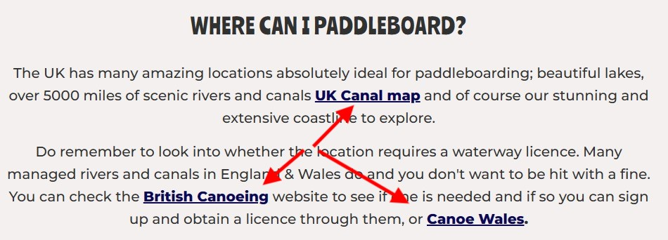

<h1 align = "center">Sup Sup & Away!<h/1>

<h2 align = "center"></h2>

[View the live project here.](https://nddpj00.github.io/sup-sup-away/)

Paddleboarding is a relatively new phenomenon, with a lot of people looking for information and guidance on how and in particular, *where* to get started.

This is where my site can help.  It makes use of its huge database of researched locations together with the unique 'Finder Tool' to help determine the best destinations based on your specific requirements.

## User Experience (UX)

-   ### User stories

    -   #### First-Time Visitor Goals

        1. As a First-Time Visitor, I want to easily understand the main purpose of the site.
        2. As a First-Time Visitor, I want to be able to easily navigate through the site to find content; including links to social media and other external sources.
        3. As a First-Time Visitor, I want to be able to interact with the site. Initiate controls and be given feedback.

     -  #### Returning Visitor Goals

        1. As a Returning Visitor, I want to find information about paddleboarding in the UK.
        2. As a Returning Visitor, I want to find information about where in the UK are good, suitable locations to paddleboard.
        3. As a Returning Visitor, I want to know the requirements and equipment needed to paddleboard in the UK.

    -   #### Frequent User Goals
        1. As a Frequent User, I want to find new locations to paddleboard as I become more experienced or have more equipment.
        2. As a Frequent User, I want to use the finder tool to help me plan my paddleboarding breaks.
        3. As a Frequent User, I want to be able to keep up to date with any social media activity relating to Sup Sup & Away!.

-   ### Design
    -   #### Colour Scheme
        -   The main background is off-white #f3f0ef. The finder tool includes orange for the buttons and some backgrounds hsl(27, 88%, 66%);. Otherwise, the majority of the remainder is made up of photography.
    -   #### Typography
        -   The main headings used a font called 'Ranchers' including the H1 hero and the h2 heading at the beginning of each paragraph. It's typical of the 1950s, used on posters and designed to be big - for maximum effect. I felt it worked well for a surfing feel of the site. The Montserrat font is used for the paragraphs throughout the website with Sans Serif as the fallback font in case for any reason the font isn't being imported into the site correctly.
    -   #### Imagery
        -   I chose photographs that either had a sepia, vintage tone about them or had scenes of attractive landscapes. This was to give the site an overall style that links in with the font and compliments the overall retro, surf style.

*   ### Wireframes

   **Large Screen Wireframe**
   

   **Tablet Screen Wireframe**
   

   **Mobile Screen Wireframe**
   

##  Features

1. Responsive on all device sizes

2. Hero image/navigation  
   Simple, unfussy navigational links, engaging hero text and a stand-out button to take you straight to the main function of the site.  
   

3. The Finder Tool.
   This is the main function of the site.  
   It offers users a tool that takes the responses to a few key questions to work out the best locations for them to paddleboard.

   - Start Button. It initiates on the 'Start' button as directed on the page.  
   

   - Questions. Runs through 4 questions.
   

   - Results. Provides a results page, listing the locations best suited to the user and marking them on the Google map.
   

   - Google Map. The markers can be clicked to zoom in closer on the map and open an Info Window with the URL relevant to the location.  The marker can then be clicked again to zoom back out.  
   

   - Alert. If the user tries to click next without selection they will receive an alert.
   

   - Restart - At any time the user can choose to restart the questions by selecting the 'Restart' button.


## Technologies Used

### Languages Used

-   [HTML5](https://en.wikipedia.org/wiki/HTML5)
-   [CSS3](https://en.wikipedia.org/wiki/Cascading_Style_Sheets)
-   [Javascript](https://en.wikipedia.org/wiki/JavaScript)

### Frameworks, Libraries & Programs Used

1.  [Bootstrap 5.3.0:](https://getbootstrap.com/docs/5.3/getting-started/introduction/)
    - Bootstrap was used to assist with the responsiveness and styling of the website.
1.  [Hover.css:](https://ianlunn.github.io/Hover/)
    - Hover.css was used on the Social Media icons in the footer to add the float transition while being hovered over.
1.  [Google Fonts:](https://fonts.google.com/)
    - Google fonts were used to import the 'Ranchers' and 'Monserrat' fonts into the style.css file.
1.  [GitHub:](https://github.com/)
    - GitHub is used to store the project's code after being pushed from Git.
1.  [Balsamiq:](https://balsamiq.com/)
    - Balsamiq was used to create the during the design process.
1.  [BrowserStack:](https://www.browserstack.com/docs/)
    - BrowserStack allowed manual testing of the site of all different browsers and devices.
1.  [Google Maps:](https://developers.google.com/maps/documentation/javascript/overview)
    - Used Googles Map API to integrate with code to provide additional interactivity. 
1.  [Unsplash:](https://unsplash.com/)
    - Unsplash provided a free resource for the photos used on the site.
1.  [Tinypng:](https://tinypng.com/)
    - Tinypng was used to compress the photos to improve site load times.

## Testing

### Manual Vs Automated Testing

- I opted to **manually** test my site.  The reasons are -  

    1. As the sole developer I can quickly carry out tests as I go and can obtain immediate results from the tests.
    2. The site I have is only one page, consisting of 10 links and the main function - the 'finder tool'.  I have devised a 10-point test process that will be carried out on multiple, most commonly used browsers and devices. It provides a very thorough, robust and comprehensive solution to ensure the site has no bugs, errors or anomalies.
    3. As the main purpose of the site is to learn Javascript, show understanding and gain a qualification; and won't need to be maintained in the long term, I felt the time it would take to build an automated testing process was unnecessary on this occasion.  In a real-world situation, the use of a test framework, such as Jest would be invaluable to ensure the continuous integrity of the site.
    4. UX testing. Important to the overall usability of the site and can only be carried out via manual testing. Automated testing lacks human observation and cognitive abilities.

- Reasons why I would use Automated Testing in the future for other projects.

    1. Larger scale site or application that may have multiple pages and an increased amount of functionality and code. Manual testing would take too long.
    2. Working in a team. Possibly no one person with in-depth knowledge of how the whole site should work and perform. Automated tests would allow anyone to run them.
    3. Continual code added to the site. Automated tests can be run after every addition, ensuring no disruption to the existing code.
    4. Higher accuracy. Important if the site is in the public domain and linked to an organisation. To avoid deprecation of the 'brand' due to a poor website.
    5. Time. Though they take longer to set up initially, having a bespoke automated testing process will save time in the long run, due to how frequently they need to be run when maintaining and improving the site.

### Validators

-   W3C Markup Validator complete without errors.
   

    
-   W3C CSS Validator complete without errors.
     

-   JS Hint Javascript Validator installed and showing no errors or warnings.
    -  The validator initially gave out warnings for using ES6 declarations'let' and 'const'. Adjusting the 
  options meant the linter accepted these. see main.js ln1, col1 (esversion:6 added to options)
    - The validator gave a warning for using a Spread operator as only available since ES9. Option added to linter to ignore. see main.js ln1, col1 (esversion:9 added to options)
    - The validator gave the following warning - Functions declared within loops referencing an outer scoped variable may lead to confusing semantics. (map) (W083).  
      This is referencing the Google Map marker function. The loop is providing multiple variables so I've decided to leave this where it is.  I feel within the required scope of the site the semantics won't be an issue.  
      JS lint provides a 'relaxed' option for these types of concerns, which I've triggered.  
      See main.js ln1, col1 (loopfunc:true )

-   Lighthouse Accessibility.
    - Running at a score of 98 due to background on links not having a high enough contrast.  

    
    
    Updated with a stronger, dark blue background to achieve 100.  
    

-   Lighthouse Overall Performance.
   - Performance 93 - After reducing and compressing all images.
   - Best Practices 100
   - SEO 100  
    

### Testing User Stories from User Experience (UX) Section

-   #### First-Time Visitor Goals

  1. As a First Time Visitor, I want to easily understand the main purpose of the site.
  - Upon entering the site, users are greeted with a clear image that includes a paddleboarder and H2 heading stating 'UK Paddleboarding Destination Specialist'.  
  - As a single-page site I decided to keep the navigation bar simple, offering opportunities to go straight to social media links or to contact via email.  
    
  - There are two 'call to arms' - a button stating 'Click for Destination Finder' and at the bottom the start of a new section to scroll down to, with a H2 heading 'What is Paddleboarding?'

  2. As a First Time Visitor, I want to be able to easily navigate through the site to find content; including links to social media and other external sources.
  - The site has been designed to be fluid and never entrap the user. At the top of the single page, there is a 'socials' option to take you straight to the bottom of the page where all the social media icons are available to be clicked.  
  
  - The 'Click for Destination Finder' button is clear and very visible when entering the site to allow quick access to this tool, without having to scroll down.
  - Clues given to scroll down with the top of the 'What is Paddleboarding' heading, to encourage user investigation.
  - When using the finder tool, there is always an option to select the 'Restart' button to begin the process again. This can be triggered during the questions or at the end, with the results.  
  
  - When the user is interacting with the Google Map, I've included functionality allowing the user to zoom back out of the marker by selecting the marker again.  Instructions are provided to the right or above (depending on the device) of the map.
  - Links are included within the body of the text to external resources relating to Waterways and licences.
  - Links to navigate away from the site to one of the suitable locations are provided within the map marker Info Window.  
  
  
  3. As a First Time Visitor, I want to be able to interact with the site. Initiate controls and be given feedback.
  - User interaction is required to complete the questionnaire (finder tool) and answer questions.
  -  The user can navigate the Google Map, zoom in, zoom back out and click on the links to external information relating to their results.
  - If no selection is made, before selecting the 'next' button, then an alert is triggered asking them to make a selection.    
  
  - When making a selection the button turns green to provide affirmative feedback.  
  
  - Navigation 'Socials' and 'Contact' links have a hover function that underlines the option about to be selected.   
  
  - Social media icons change colour when hovered over.  
  


- #### Returning Visitor Goals

 1. As a Returning Visitor, I want to find information about paddleboarding in the UK.
 - General information is provided within the 3 sections of the main body. Addressing - What is Paddleboarding?, What do I need? and Where can I paddleboard?
 - Links are also included to external resources that offer maps to the UK Canal network and licence requirements.  
 
 2. As a Returning Visitor, I want to find information about where in the UK are good, suitable locations to paddleboard.
 -  The finder tool will determine the most suitable locations based on the user's requirements.  The results from the questions will provide the areas and clubs via a marker on the map. When selecting one of the markers an Info Window opens displaying a URL to take them externally for more detailed information about that location.  
 
 - The link to the Canal map is also a very useful resource.
 3. As a Returning Visitor, I want to know the requirements and equipment needed to paddleboard in the UK.
 - Information is provided within the 'What Do I need?' section.
 - licence information can be obtained from the provided links to the British Canoe site and Wales Canoe site. The link takes you straight to the checker whereby you can input the name of the lake or river and find out licence requirements.
 

 -   #### Frequent User Goals

1. As a Frequent User, I want to find new locations to paddleboard as I become more experienced or have more equipment.
- By selecting different responses to questions such as 'Level of Experience?' or 'Do you need to hire equipment?' will provide different locations to explore.
- If running as a fully maintained site - new locations would need to be added and existing ones checked and updated.
2. As a Frequent User, I want to use the finder tool to help me plan my paddleboarding breaks.
- The Google map can be enlarged allowing for multiple location planning.
- Links to all the locations included in the users results are also provided.  

3. As a Frequent User, I want to keep up to date with any social media activity relating to Sup Sup & Away!
- Icons are included at the bottom of the site to provide access to Facebook, Instagram and Twitter.
- A shortcut is included on the navigation bar at the top to save scrolling down through the entire site.
- If users would like to email direct then their preferred email client opens when clicking on 'Contact' in the nav bar or the email link at the bottom of the page.

### UX Manual Test process  

  - The Test  

    I enlisted the help of 5 family members.  All with varying degrees of *tech savvy-ness* if you like.  Different age ranges from my six-year-old daughter to my mother (I'll spare her by not giving her age away).

    I gave them my smartphone with the site loaded up and gave one instruction and no further advice or information.

    **'Find a paddleboarding location that would be best suited to you.'**  

    I then observed them navigating the site, using the finder tool and the corresponding map to obtain the information.

- ##### Outcomes - 

    Though the test is a little rudimentary it provided a lot of insight, watching people unfamiliar with the site trying to use it.  
    
  * The Good  

    Everyone was successful in navigating the site to the finder tool and instigating the questionnaire.  They liked how well 'sign-posted' this was.  

    They thought the overall site was engaging and pleasantly laid out.
    
    They liked how the locations were marked on the map and all testers understood these correlated to the results they had been given.

  * The Bad

    Some didn't realise the map could be interacted with.

    Some that clicked on the map and zoomed in didn't realise they could click the marker again to zoom out. They then tried slowly zooming out.

    If zooming back out using the zoom controls of the map, the info window was still open - hiding some of the other markers.


  * Actions taken

    I added some instructions to help with the navigation of the map.  
    

    I added code to remove the Info Window when zooming back out using the marker.  This allows the user to see all the result markers again allowing a subsequent selection, zooming in - then back out.  This works and feels a lot better for the user.

### 10-point Manual Test process  

I used a programme called Browserstack to perform the tests. This is software provided as part of the course, included in the Student Developer pack.

The application recommended that 1 x high-end, 1 x low-end device and a tablet is tested for each main manufacturer of smart devices.  I've tested Apple, Samsung, and Google.

Also, I've tested the site on a broad cross-section of browsers.  Chrome, Edge, Safari and Firefox.

Here are the devices/browsers and a screenshot of the front page of my site.  


The 10-points are as follows -   
Links
1. Check nav bar links work. 'Contact' opens the email client and 'Socials' takes you to bottom of the page.*
2. The button on the hero image 'Click here for finder tool' takes you to the tool.
3. Social media icons in the footer open the respective sites.
4. Email link in the footer opens the email client.*
*Some errors are expected on devices advising default email not set up.

  Finder Tool  
5. Run through questions with 3 x different permitations per device.
6. Check the 'Restart' button resets the tool during the questions and at the result stage.
7. Check the 'Next' button without selection prompts alert and doesn't affect results.
8. Check the results provided match the markers on the map.
9. Check the map markers zoom in and zoom out and the Info Window is present with the correct URL displaying.
10. Check the URL is active and opens to an external site in a new tab.

A small selection of screenshots showing the cross-browser testing.  
Safari 16
  
Samsung Tab8
  
Samsung Ultra 22

Ipad Pro 12.9 2022


  ## Bugs
  1. Missing target="_blank" on Canoe Wales link. Doesn't load in a separate tab.
  2. Broken link to one of the locations. 
  3. Typo in a URL for one of the locations.
  4. During development I had an intermittent bug where the Google Map wouldn't load.
  
  5. During development I was getting a console error referring to a missing Favicon.
  6. Error with Permissions-Policy header: Origin trial controlled feature not enabled: 'interest-cohort'. in the console.
  -    NB. Unable to test hover on mobile and tablet devices and no mouse cursor.

  ## Fixes
  1. Code added - target="_blank"
  2. Updated object with a valid URL.
  3. Corrected typo.
  4. The issue was that I had the Google Map trying to load before the Javascript. This was solved with help from my mentor.  A simple 'defer' added to the script fixed it.
   
  5. I decided the easiest solution was to design a little icon and add it to clear the error. In the end I was quite pleased with it!  
   
  6. Researching the error message it appears no action is required.  Git Hub pages disable FLOC which is a user-tracking tool.
    https://stackoverflow.com/questions/69619035/error-with-permissions-policy-header-unrecognized-feature-interest-cohort
    https://github.blog/changelog/2021-04-27-github-pages-permissions-policy-interest-cohort-header-added-to-all-pages-sites/

   I'm happy that this completes the testing process for my site. It is error-free and works well across all the most popular browsers, along with being responsive on all different size devices.

   ### Known Bugs
No known bugs


## Deployment

### GitHub Pages

The project was deployed to GitHub Pages using the following steps...

1. Log in to GitHub and locate the [GitHub Repository](https://github.com/)
2. At the top of the Repository (not top of page), locate the "Settings" Button on the menu.
    - Alternatively, Click [Here](https://raw.githubusercontent.com/) for a GIF demonstrating the process starting from Step 2.
3. Scroll down the Settings page until you locate the "GitHub Pages" Section.
4. Under "Source", click the dropdown called "None" and select "Master Branch".
5. The page will automatically refresh.
6. Scroll back down through the page to locate the now-published site [link](https://github.com) in the "GitHub Pages" section.

### Forking the GitHub Repository

By forking the GitHub Repository we make a copy of the original repository on our GitHub account to view and/or make changes without affecting the original repository by using the following steps...

1. Log in to GitHub and locate the [GitHub Repository](https://github.com/)
2. At the top of the Repository (not top of page) just above the "Settings" Button on the menu, locate the "Fork" Button.
3. You should now have a copy of the original repository in your GitHub account.

### Making a Local Clone

1. Log in to GitHub and locate the [GitHub Repository](https://github.com/)
2. Under the repository name, click "Clone or download".
3. To clone the repository using HTTPS, under "Clone with HTTPS", copy the link.
4. Open Git Bash
5. Change the current working directory to the location where you want the cloned directory to be made.
6. Type `git clone`, and then paste the URL you copied in Step 3.

```
$ git clone https://github.com/YOUR-USERNAME/YOUR-REPOSITORY
```

7. Press Enter. Your local clone will be created.

```
$ git clone https://github.com/YOUR-USERNAME/YOUR-REPOSITORY
> Cloning into `CI-Clone`...
> remote: Counting objects: 10, done.
> remote: Compressing objects: 100% (8/8), done.
> remove: Total 10 (delta 1), reused 10 (delta 1)
> Unpacking objects: 100% (10/10), done.
```

Click [Here](https://help.github.com/en/github/creating-cloning-and-archiving-repositories/cloning-a-repository#cloning-a-repository-to-github-desktop) to retrieve pictures for some of the buttons and more detailed explanations of the above process.

## Credits

### Code

-   [Bootstrap5](https://getbootstrap.com/docs/5.0/examples/) 
The main structure is based on the Bootstrap5 Grid system.
Buttons for styling and responsiveness
-   [GoogleMap](https://www.google.co.uk/maps)
The map to depict the location of the results.
-   [JSHint](https://jshint.com/)
Validating my Javascript code, cleaning it up and removing unnecessary semi-colons!


### Content

-  https://codepen.io/maheshambure21/pen/QwXaRw
  The navigation hover effect was taken from this site.
-   All remaining content was written by the developer.


### Media

-   [Unsplash]( https://unsplash.com/)All photos used came from unsplash.
-   [Font-Awesome](https://fontawesome.com/) Social media icons.

### Acknowledgements

-   My Mentor for continuous helpful feedback.

-   EKC course facilitator for introducing me to many new concepts and software and lots of great advice.